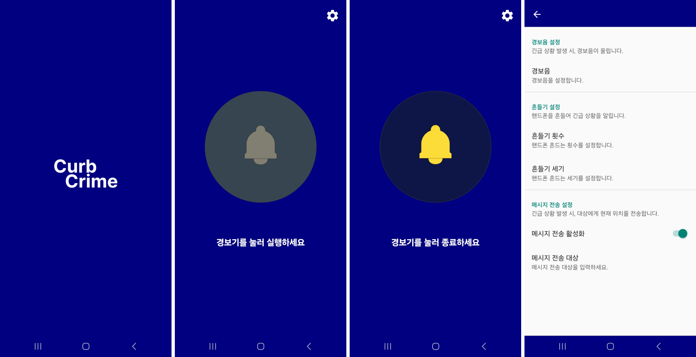
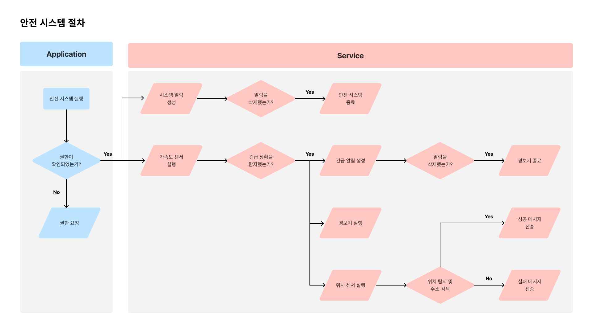

# CurbCrime

## Application

<b>CurbCrime</b>은 안전 위협에 직면했을 때 빠르게 대응할 수 있는 솔루션을 제공하는 애플리케이션입니다. 간편한 동작으로 위험 상황을 탐지하고, 사용자가 지정한 연락처에 신속하게 위치 정보를 전송하여 도움을 요청하고, 경보음을 울려 사용자에게 주의를 끌어줍니다.

- <b>위험 상황 탐지</b> : 사용자가 위험에 노출됐다고 판단된 경우, 핸드폰을 흔들어 위험 상황을 알립니다.

- <b>경보음 발생</b> : 위험 상황이 탐지되면, 경보음을 울려 상황을 주변에 전파합니다.

- <b>실시간 위치 감지</b> : 위험 상황이 탐지되면, 사용자의 현재 위치를 감지합니다.

- <b>메시지 전송</b> : 위험 상황이 탐지되면, 미리 설정한 연락처에 위치 정보를 전송합니다.

 

## 📷 ScreenShots 

 

## 📝 Storyboard
[Storyboard PDF 파일 다운로드](./docs/storyboard-1.0.0.pdf)

 

## 🧷 System Flow

  

# LICENSE
Copyright 2024 CurbCrime

Licensed under the Apache License, Version 2.0 (the "License");
you may not use this file except in compliance with the License.
You may obtain a copy of the License at

    http://www.apache.org/licenses/LICENSE-2.0

Unless required by applicable law or agreed to in writing, software
distributed under the License is distributed on an "AS IS" BASIS,
WITHOUT WARRANTIES OR CONDITIONS OF ANY KIND, either express or implied.
See the License for the specific language governing permissions and
limitations under the License.